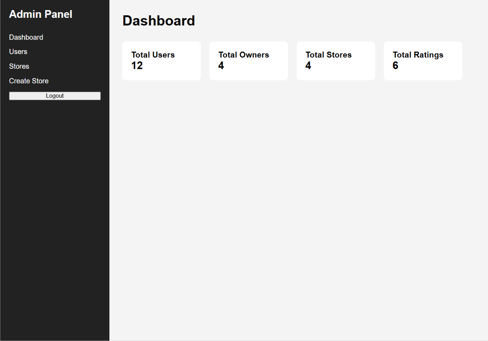
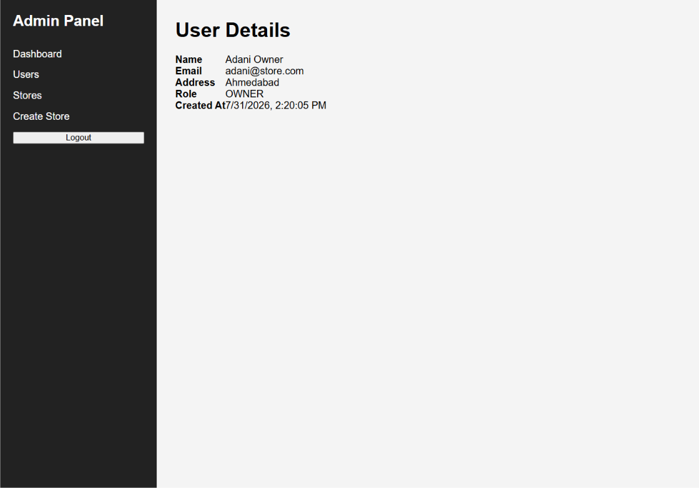
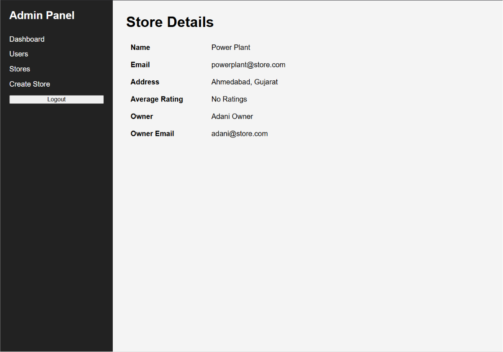
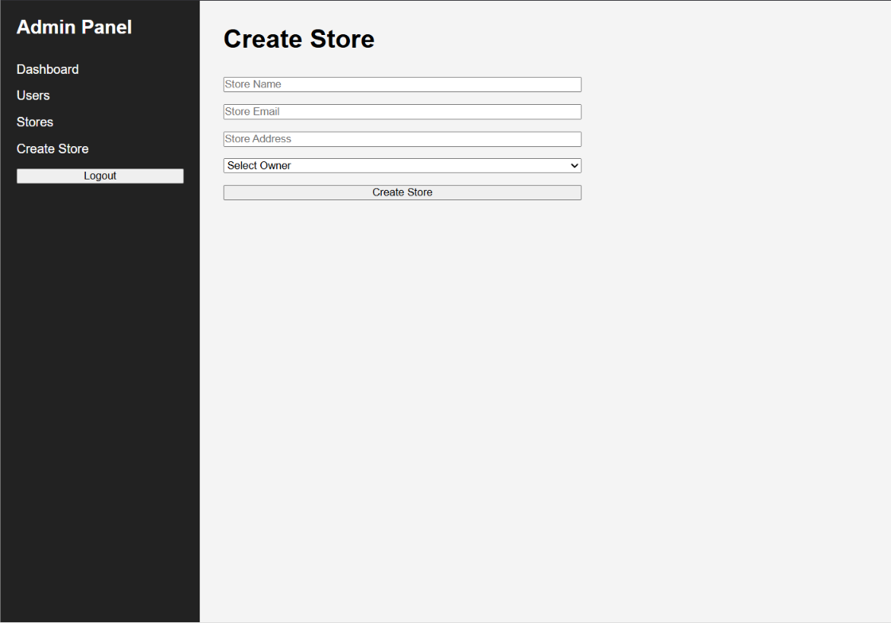
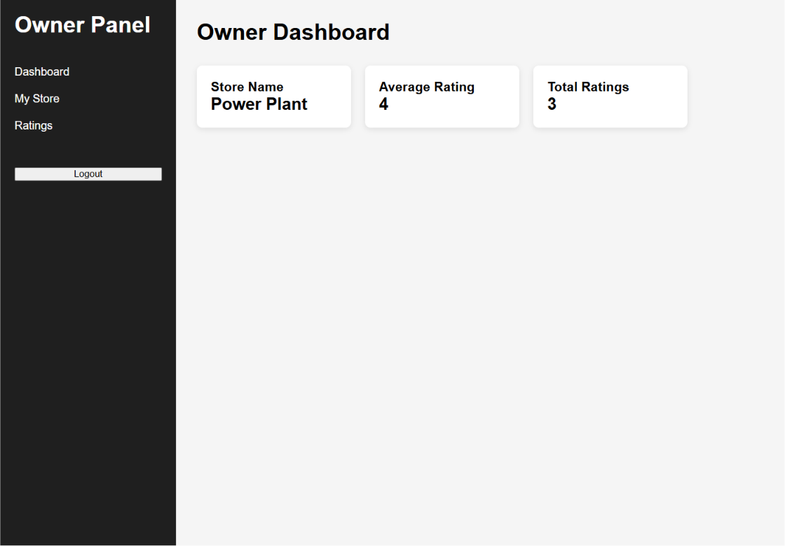
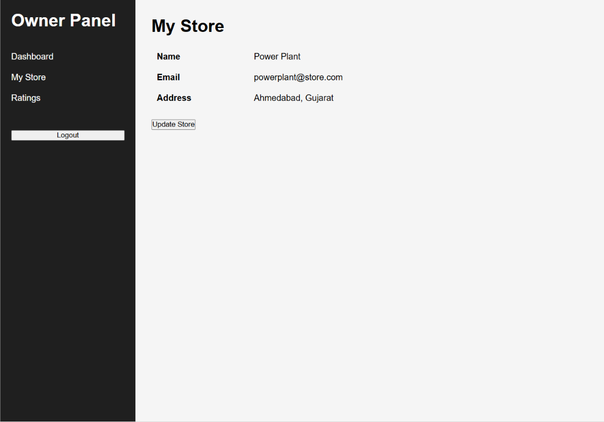
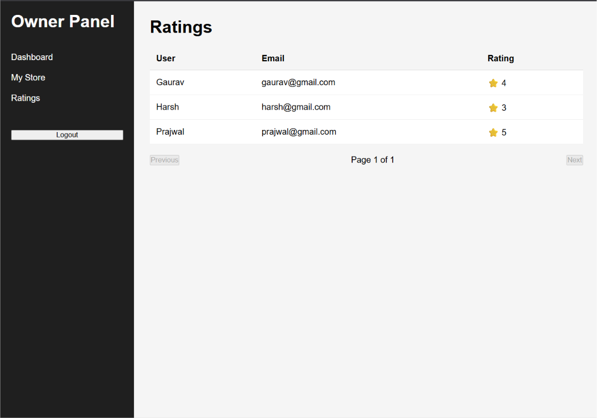
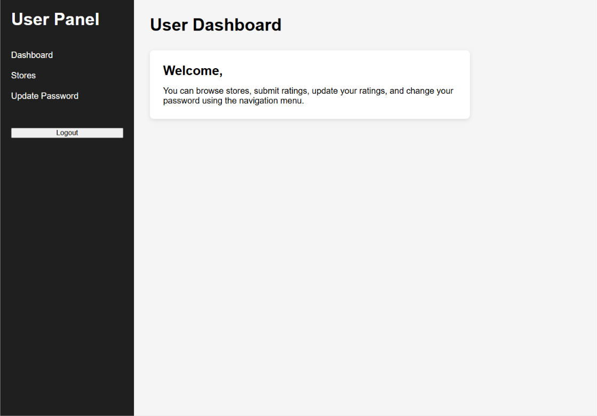

# Store Rating App

A full-stack Store Rating application built using **React**, **Node.js**, **Express.js**, **Prisma ORM**, and **PostgreSQL**. The application supports three different roles (Admin, Owner, and User) with role-based authentication and authorization using JWT.

---

# Features

## Authentication

- User Signup
- User Login
- JWT Authentication
- Role-Based Authorization
- Password Hashing using bcrypt
- Protected Routes

---

## Admin Features

- Dashboard Statistics
  - Total Users
  - Total Owners
  - Total Stores
  - Total Ratings
- Create Users (Admin, Owner, User)
- View All Users
- Search Users
- Sort Users
- Pagination
- View User Details
- Create Stores
- View All Stores
- Search Stores
- Sort Stores
- Pagination
- View Store Details

---

## Owner Features

- Dashboard
- View Store Details
- Update Store Information
- View Customer Ratings

---

## User Features

- Browse Stores
- Search Stores
- Pagination
- View Overall Store Rating
- View Own Submitted Rating
- Submit Rating
- Update Rating
- Update Password

---

# Tech Stack

## Frontend

- React
- React Router DOM
- Axios
- Vite

## Backend

- Node.js
- Express.js
- Prisma ORM
- PostgreSQL
- JWT
- bcrypt

## Validation

- Zod

---

# Project Structure

```
Store-Rating-App
│
├── backend
│   ├── prisma
│   ├── src
│   │   ├── config
│   │   ├── controllers
│   │   ├── middleware
│   │   ├── repositories
│   │   ├── routes
│   │   ├── services
│   │   ├── utils
│   │   ├── validations
│   │   └── server.js
│   └── package.json
│
├── frontend
│   ├── src
│   │   ├── api
│   │   ├── components
│   │   ├── context
│   │   ├── layouts
│   │   ├── pages
│   │   ├── routes
│   │   ├── services
│   │   ├── utils
│   │   ├── App.jsx
│   │   └── main.jsx
│   └── package.json
│
└── README.md
```

---

# Installation

## 1. Clone the Repository

```bash
git clone <your-github-repository-url>
cd Store-Rating-App
```

---

# Backend Setup

```bash
cd backend
npm install
```

Create a `.env` file inside the backend directory.

```env
DATABASE_URL="your_database_url"
JWT_SECRET="your_secret_key"
PORT=5000
```

Generate Prisma Client

```bash
npx prisma generate
```

Run Migrations

```bash
npx prisma migrate deploy
```

(Optional) Seed the Database

```bash
npm run seed
```

Start Backend

```bash
npm run dev
```

Backend will run on:

```
http://localhost:5000
```

---

# Frontend Setup

```bash
cd frontend
npm install
npm run dev
```

Frontend will run on:

```
http://localhost:5173
```

---

# API Endpoints

## Authentication

```
POST /api/v1/auth/signup
POST /api/v1/auth/login
```

## Admin

```
GET    /api/v1/admin/dashboard

POST   /api/v1/admin/users
GET    /api/v1/admin/users
GET    /api/v1/admin/users/:id

POST   /api/v1/admin/stores
GET    /api/v1/admin/stores
GET    /api/v1/admin/stores/:id
```

## Owner

```
GET    /api/v1/owner/dashboard
GET    /api/v1/owner/store
PUT    /api/v1/owner/store
GET    /api/v1/owner/ratings
```

## User

```
GET    /api/v1/user/stores
POST   /api/v1/user/ratings
PUT    /api/v1/user/ratings
PUT    /api/v1/user/password
```

---

# Test Credentials

Replace these with your seeded credentials.

## Admin

```
Email:
Password:
```

## Owner

```
Email:
Password:
```

## User

```
Email:
Password:
```

---

# Screenshots

Add screenshots for the following pages:

- Login

- Admin Dashboard

- Users

- User Details

- Stores

- Store Details

- Create Store

- Owner Dashboard

- My Store

- Ratings

- User Dashboard

- Browse Stores

- Submit Rating

- Update Rating

- Update Password


---

# Future Improvements

- Better UI using a component library (Material UI/Tailwind CSS)
- Toast notifications instead of browser alerts
- Advanced filtering
- Profile management
- Unit and integration tests
- Docker support
- Deployment to a cloud platform

---

# Author

**Ghosh Bisen**

Built as a Full Stack Store Rating Application using React, Express.js, Prisma ORM, PostgreSQL, and JWT Authentication.